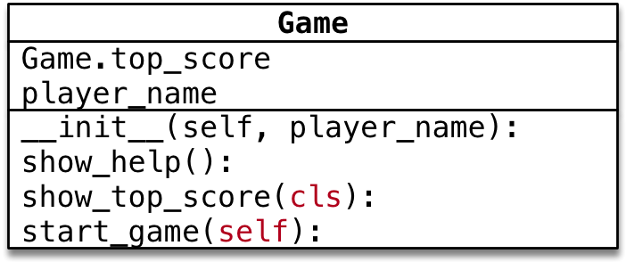

# 类属性和类方法

## 目标
1. 类的结构
2. 类属性和实例属性
3. 类方法和静态方法

## 01. 类的结构

### 1.1 术语 —— 实例
1. 使用面相对象开发，第 1 步 是设计 类  
2. 使用 __类名()__ 创建对象，创建对象 的动作有两步：  
    1) 在内存中为对象 __分配空间__
    2) 调用初始化方法 \_\_init\_\_ 为 对象初始化
3. 对象创建后，__内存__ 中就有了一个对象的 __实实在在__ 的存在 —— __实例__  


因此，通常也会把：  
1. 创建出来的 __对象__ 叫做 __类__ 的 __实例__
2. 创建对象的 __动作__ 叫做 __实例化__
3. 对象的属性 叫做 __实例属性__
4. 对象调用的方法 叫做 __实例方法__

在程序执行时：
1. 对象各自拥有自己的 实例属性
2. 调用对象方法，可以通过 self.
3. 访问自己的属性
4. 调用自己的方法

结论:  
1. 每一个对象 都有自己 独立的内存空间，保存各自不同的属性
2. 多个对象的方法，在内存中只有一份，在调用方法时，需要把对象的引用 传递到方法内部

### 1.2 类是一个特殊的对象
Python 中 __一切皆对象__ ：  
    class AAA: 定义的类属于 类对象  
    obj1 = AAA() 属于 实例对象  

1. 在程序运行时，__类__ 同样 __会被加载到内存__     
2. 在 Python 中，__类__ 是一个特殊的对象 —— __类对象__  
3. 在程序运行时，__类对象__ 在内存中 __只有一份__，使用 __一个类__ 可以创建出 很多个对象实例
4. 除了封装 __实例__ 的 __属性__ 和 __方法外__ ，__类对象__ 还可以拥有自己的 __属性__ 和 __方法__
    1) 类属性
    2) 类方法
5. 通过 __类名.方法__ 的方式可以 __访问类的属性__ 或者 __调用类的方法__   


## 02. 类属性和实例属性

### 2.1 概念和使用
1. 类属性 就是给 类对象 中定义的 属性
2. 通常用来记录 与这个类相关 的特征
3. 类属性 不会用于记录 具体对象的特征

示例需求:  
1. 定义一个 工具类
2. 每件工具都有自己的 name  
3. 需求 —— 知道使用这个类，创建了多少个工具对象？  

|名称|操作|
|:--:|:--:|
|类名| Tool|
|属性| Tool.count,  name|
|方法| \_\_init\_\_(self, name)|


```

class Tool(object):

    # 使用赋值语句，定义类属性，记录创建工具对象的总数
    count = 0

    def __init__(self, name):
        self.name = name

        # 针对类属性做一个计数+1
        Tool.count += 1


# 创建工具对象
tool1 = Tool("斧头")
tool2 = Tool("榔头")
tool3 = Tool("铁锹")

# 知道使用 Tool 类到底创建了多少个对象?
print("现在创建了 %d 个工具" % Tool.count)
```

### 2.2 属性的获取机制（科普）
在 Python 中 属性的获取 存在一个 向上查找机制


因此，要访问类属性有两种方式：  
    类名.类属性
    对象.类属性 （不推荐）

注意:  
如果使用 __对象.类属性 = 值__ 赋值语句，只会 __给对象添加一个属性，而不会影响到__ 类属性的值

## 03. 类方法和静态方法  

### 3.1 类方法
1. __类属性__ 就是针对 __类对象__ 定义的属性
    1) 使用 __赋值语句__ 在 __class__ 关键字下方可以定义 __类属性__
    2) __类属性__ 用于记录 __与这个类相关 的特征__
2. __类方法__ 就是针对 __类对象__ 定义的方法
    1) 在 __类方法__ 内部可以直接访问 __类属性__ 或者调用其他的 __类方法__

语法如下: 
```
@classmethod
def 类方法名(cls):
    pass
```

1. 类方法需要用 __修饰器 @classmethod__ 来标识，告诉解释器这是一个类方法
2. 类方法的 __第一个参数__ 应该是 __cls__
    由 __哪一个类__ 调用的方法，方法内的 __cls__ 就是 __哪一个类的引用__
    这个参数和 __实例方法__ 的第一个参数是 __self__ 类似
    __提示__ 使用其他名称也可以，不过习惯使用 __cls__


3. 通过 类名. 调用 类方法，调用方法时，不需要传递 cls 参数
4. 在方法内部
    可以通过 __cls.__ 访问类的属性  
    也可以通过 __cls.__ 调用其他的类方法  

__示例需求__ :   
定义一个 __工具类__  
每件工具都有自己的 __name__  
需求 —— 在 __类__ 封装一个 __show_tool_count__ 的类方法，输出使用当前这个类，创建的对象个数  


```
@classmethod
def show_tool_count(cls):
    """显示工具对象的总数"""
    print("工具对象的总数 %d" % cls.count)
```
在类方法内部，可以直接使用 __cls__ 访问 __类属性__ 或者 __调用类方法__  

### 3.2 静态方法:  
在开发时，如果需要在 类 中封装一个方法，这个方法：
    既 __不需要__ 访问 __实例属性__ 或者调用 __实例方法__  
    也 __不需要__ 访问 类属性 __或者调用__ 类方法
    这个时候，可以把这个方法封装成一个 __静态方法__  

语法如下:  
```
@staticmethod
def 静态方法名():
    pass
```
静态方法 需要用 __修饰器 @staticmethod__ 来标识，告诉解释器这是一个静态方法
通过 __类名.方法()__ 调用 静态方法

```
class Dog(object):
    
    # 狗对象计数
    dog_count = 0
    
    @staticmethod
    def run():
        
        # 不需要访问实例属性也不需要访问类属性的方法
        print("狗在跑...")

    def __init__(self, name):
        self.name = name
```

### 3.3 方法综合案例
需求:  
  设计一个 __Game__ 类  
属性：
  定义一个 类属性 __top_score__ 记录游戏的 历史最高分  
  定义一个 实例属性 __player\_name__ 记录 当前游戏的玩家姓名  
方法：
  静态方法 __show_help__ 显示游戏帮助信息  
  类方法 __show_top_score__ 显示历史最高分  
  实例方法 __start_game__ 开始当前玩家的游戏  
主程序步骤:  
1) 查看帮助信息  
2) 查看历史最高分  
3) 创建游戏对象，开始游戏  



案例小结:  
    __实例方法__ —— 方法内部需要访问 __实例属性__  
    __实例方法__ 内部可以使用 __类名.方法()__ 访问类属性  
    __类方法__ —— 方法内部 __只__ 需要访问 __类属性__  
    __静态方法__ —— 方法内部，不需要访问 __实例属性__ 和 __类属性__  

提问:  
如果方法内部 即需要访问 __实例属性__ ，又需要访问 __类属性__ ，应该定义成什么方法？

答案 :  
应该定义 __实例方法__   
因为，类只有一个，在 __实例方法__ 内部可以使用 __类名.方法()__ 访问类属性  

```
class Game(object):

    # 游戏最高分，类属性
    top_score = 0

    @staticmethod
    def show_help():
        print("帮助信息：让僵尸走进房间")
        
    @classmethod
    def show_top_score(cls):
        print("游戏最高分是 %d" % cls.top_score)

    def __init__(self, player_name):
        self.player_name = player_name

    def start_game(self):
        print("[%s] 开始游戏..." % self.player_name)
        
        # 使用类名.修改历史最高分
        Game.top_score = 999

# 1. 查看游戏帮助
Game.show_help()

# 2. 查看游戏最高分
Game.show_top_score()

# 3. 创建游戏对象，开始游戏
game = Game("小明")

game.start_game()

# 4. 游戏结束，查看游戏最高分
Game.show_top_score()

```


